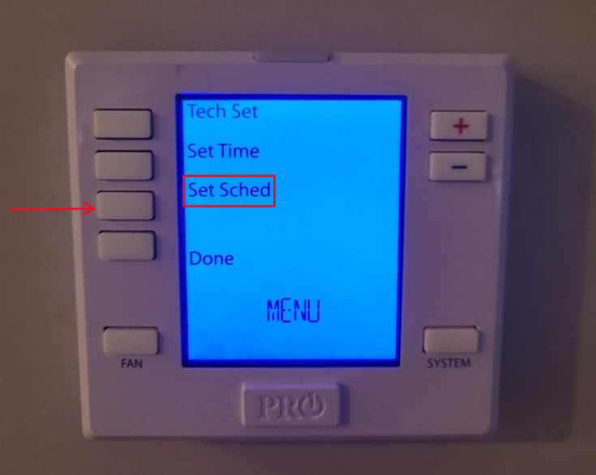
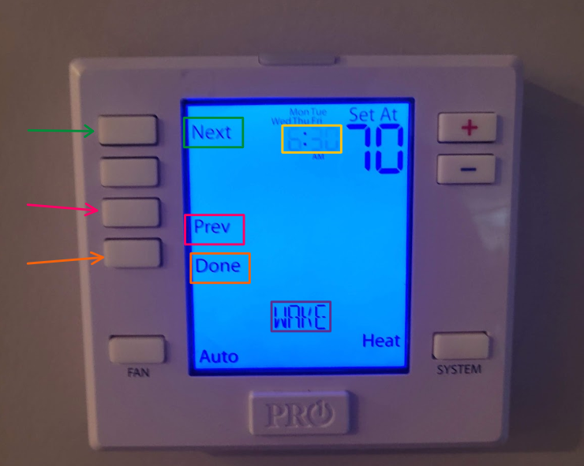
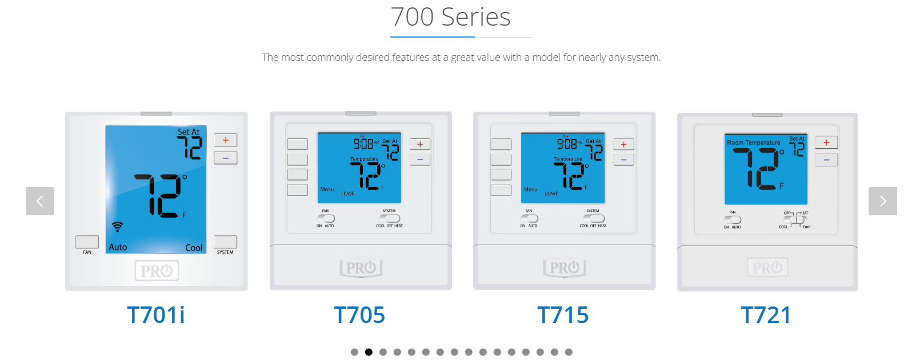

# j01
## Turning up the Heat:  Scheduling Usability in Home Thermostats
**By Cole Hanna, November 22nd, 2024**

---

### Introduction
Thermostats are a small but essential part of home comfort. The device in my apartment, a **PRO1 IAQ T755 Thermostat**, advertises itself as a _"7-day Hot/2 Cold Programmable Mountable Intuitive Thermostat."_ However, as I found out, "intuitive" isn't always what you'd expect. 

---

## The Experience

### Goal
I want to adjust the thermostat and program the **weekday** schedule so the heating is active when my roommates and I are waking up in the morning.  

---

### **Steps**

1. **Understanding the Layout**  
   The thermostat features 8 buttons:  
   - **4 side buttons** for navigating menus with one labeled on the screen as "MENU"  
   - **1 labeled "FAN"** for "On" and "Auto" settings  
   - **1 labeled "SYSTEM."** for "Off", "Heat", and "Cool" settings
   - **2 buttons** labeled on the side with "+" and "-" to increase/decrease the temperature
  
   The main screen displayed options for navigation. I decided to press "MENU" because it seemed like the logical next step. Each press of the buttons created an audible "chunk" noise in a form of simple **feedback**.
   
   The screen then displays options aligned to the side buttons:  
   - **"Tech Set"**  
   - **"Set Time"**  
   - **"Set Sched"**  
   - **"Done"**

   The alignment of these options with their corresponding buttons was inconsistent, but the interface made sense because there were four options and four buttons. I pressed "Set Sched" to adjust the schedule.

2. **Navigating the Menu**  
   Selecting **"Set Sched"** starts the process. The interface shows:  
   - **Actions**: "Next", "Prev" and "Done"
   - **Days**: "MonTueWedThuFri," "Sat," and "Sun"  
   - **Times**: Adjusted in 15-minute intervals
   - **Temperature**: Adjustable in 1-degree increments for "Cool" or "Heat"  
   - **Day Parts**: "WAKE," "LEAVE," "RETURN," and "SLEEP"

Key:
   - **Green** = Next button
   - **Pink** = Prev button
   - **Orange** = Done Button
   - **Yellow** = Flashing time section during editing
   - **Purple** = Current Day Part

   The flashing highlight on the time field indicated where my input was focused—a clear example of **feedback.** **Feedback**, in this context, reassures users that their input is being acknowledged and helps guide them through the interaction. Using the buttons "+" to increment and "-" decrement the time in periods of 15 minutes. Going past the half day, changes the day section from "AM" to "PM" and vice versa. Selecting "NEXT" changes the blinking visibility to the temperature to adjust it 1 degree at a time. You can also adjust the temperature from "Cool" to "Heat" depending on preference. Pressing "Next" again changes the bottom display section to different parts of the day from:

"WAKE" -> "LEAVE" -> "RETURN" -> "SLEEP" -> Repeat

3. **Scheduling Example**  
   - Set **WAKE** to **6:30 AM** at **70°F.**
   - Set **LEAVE** to **8:30 AM** at **70°F.**

So I set my "WAKE" time for 6:30 AM and "LEAVE" time for 8:30AM at 70 degrees. The system is also smart enough to not allow scheduling for the same time; "WAKE" and "LEAVE" being set to 10:00 AM and instead remains 15 minutes away. There wasn't any **feedback** through audio cue or error symbol that you can't go further which could frustrate the user if they weren't paying attention.  Changing between the times is also very slow, seen by my rapid clicking, since you have to press the button every time you want to cycle. After a section of the 3 days options is cycled through, it goes on to the next day's section. Next being "Sat" then "Sun" and then re-cycled back to "MonTueWedThuFri" back at its original setting state. If I wanted to go back at any point, I could press the "Prev" button to go back a section at any time. 

4. **Saving and Testing**  

I finally pressed "Done" to save my choices into the system.

When morning came, the system started running correctly but when trying to adjust the settings using the "SYSTEM" button from "Heat" to "Off", it lacked **feedback** signifying that the system was in the action of turning off and didn't seem to turn off for at least 10 minutes afterwards.

---

## Conclusion

During this process, I discovered a mix of intuitive features as well as some flaws.

#### **Strengths:**
- **Consistency**: Unused buttons were disabled, reducing user confusion.
- **Error Prevention**: The system blocked overlapping time scheduling.
- **Discoverability**: The "MENU" options being clearly labeled to the processes.
- **Learnability**: The system is pretty straight forward with simplified phrases, simple button actions, and consise screen.

#### **Weaknesses**  
- **Efficiency**: Adjusting times manually was slow due to the lack of a rapid-cycling option when holding either the "+" or "-" button.
- **Visibility**: The screen’s text didn’t align with the side buttons, and the fast timeout made the display difficult to view.  
- **Feedback**: No visual indicators but slight audio indicators from clunky buttons confirming when a button was pressed, making it harder to know if my input was registered.
- **Mental Model**: The "Next" button moved between settings (time, temperature, day parts), but it wasn’t immediately obvious. The delay between the sections flashing took too long and time between each flash was too slow. A clearer layout, better labeling, and or better timing could improve users' understanding of the workflow. 

#### **Suggestions for Improvement**  
1. Implement **rapid-cycling** for adjustments when holding down the "+" or "-" buttons. 
2. Use **highlighted text or indicators** to align options better with side buttons.
3. Extend the screen’s timeout and increase backlight brightness for improved **visibility.**  
4. Add **audio feedback** or visual indicators to show button presses are being registered.

Despite its flaws, the thermostat’s basic scheduling functionality worked as intended, albeit with some frustration. I would have preferred a different model from PRO1's 700 design series that provide more affordances and better discoverability in how buttons are designed and labeled. In all, a very great and simple design but lacked important basic **feedback** principles and usability designs.

LINK: https://pro1iaq.com/products/thermostats

[Back to Top](#)
